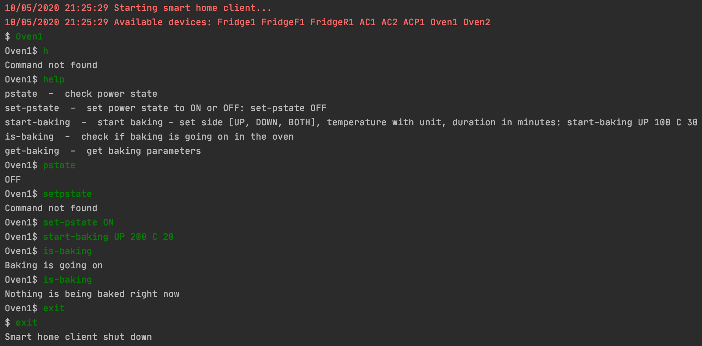
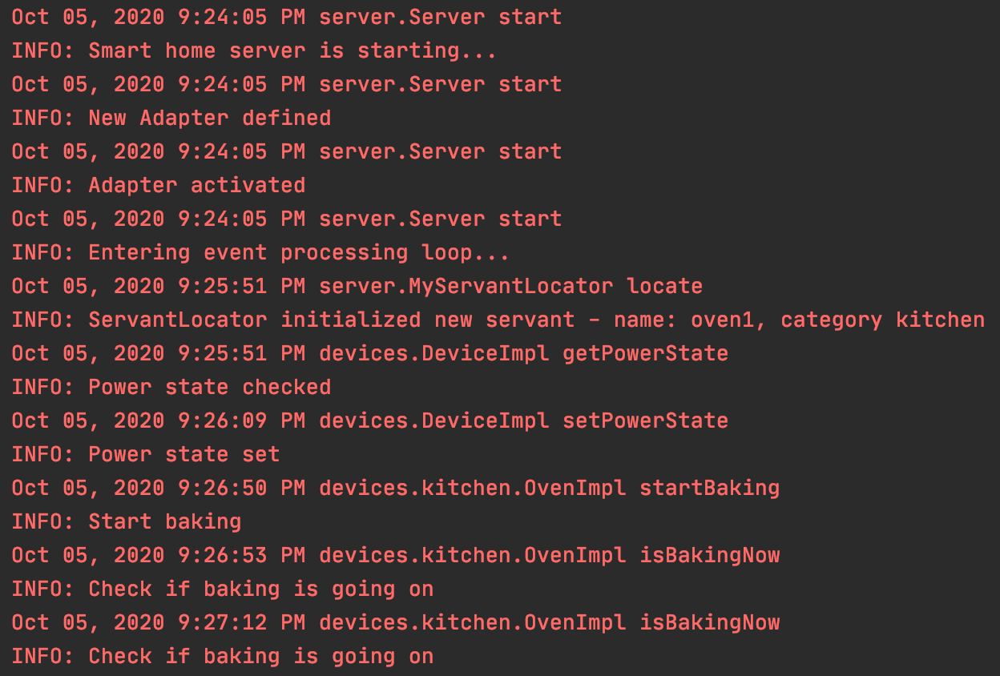

# Smart Home

Assignment from Distributed Systems course at AGH UST. Client-server app for managing devices in a smart home.

Technologies: ICE, Python, Java.

### Client

Client can view available devices and change their state. It feautures a basic CLI.

### Server

Server has a set of objects, each object corresponding to a unique device. It logs requests received from client related to devices.

